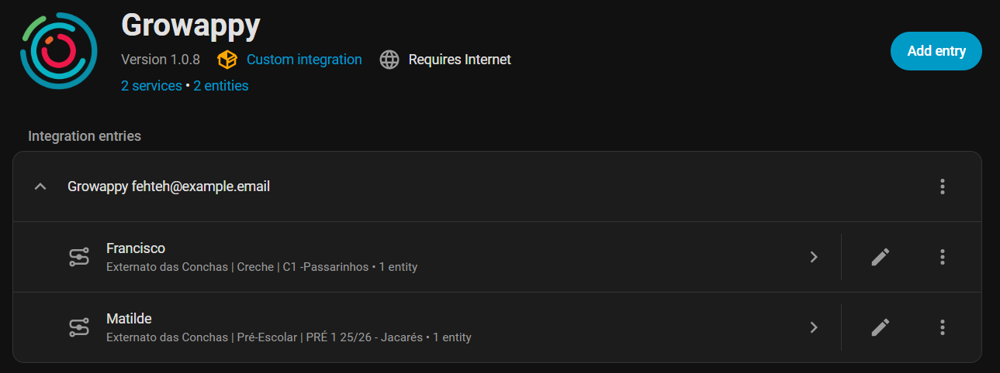
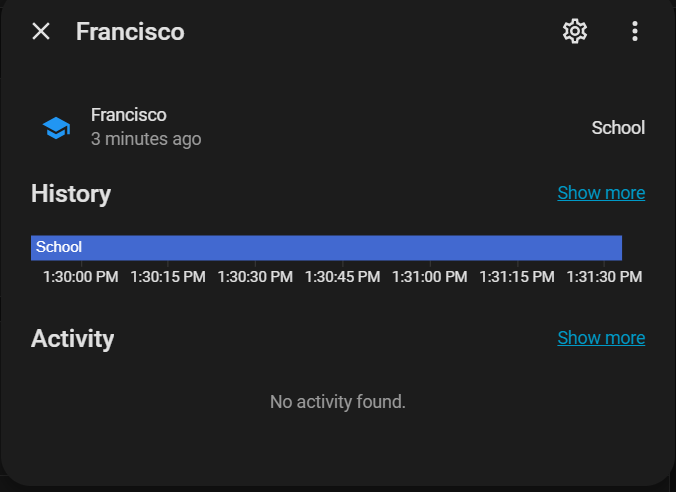

# Growappy - Custom Component for Home Assistant

A custom integration for [Home Assistant](https://www.home-assistant.io/) that tracks student attendance status from the Growappy platform.

<table>
  <tr>
    <td align="center"><strong>Services</strong> </td>
    <td align="center"><strong>Sensor</strong> </td>
  </tr>
<table>

## Features

- **Device Tracker (Presence):** Represents each student as a trackable entity.

  - Automatically identifies if a student is at a specific Zone (e.g., "School").
  - Provides real-time location status: at_school or away.
  - Integrates seamlessly with Home Assistant Person entities for map visualization.

- **Data Coordinator:** Uses a centralized polling system to fetch data for all students in a single request, optimizing network traffic and API usage.

- **Automatic Re-authentication:** Detects expired tokens and prompts for re-authentication directly through the Home Assistant UI.

## Installation

### Method 1: HACS (Recommended)

1. Ensure [HACS](https://hacs.xyz/) is installed and configured in your Home Assistant instance.
2. Open **HACS** from your sidebar.
3. Click on **Integrations**.
4. Click the three dots (⋮) in the top right corner and select **Custom repositories**.
5. Paste the URL of this repository into the **Repository** field.
6. Select **Integration** as the Category and click **Add**.
7. Once added, find the **Growappy** integration in the list and click **Download**.
8. Restart Home Assistant.

### Method 2: Manual Installation

1. Download the `custom_components/growappy` folder from this repository.
2. Copy the folder into your Home Assistant's `custom_components` directory.
3. Restart Home Assistant.

## Configuration

Once the integration is installed and Home Assistant has restarted, you can configure it via the UI:

1. Navigate to **Settings** > **Devices & Services**.
2. Click **+ Add Integration**.
3. Search for **Growappy** and follow the prompts to enter your credentials.

## API Documentation

This integration interacts with the official Growappy API. For more technical details on the data structures and endpoints, refer to the official documentation:
[https://api.growappy.com/v2/api/docs](https://api.growappy.com/v2/api/docs)

## Disclaimer

**This is a personal project.** This integration is not affiliated with, maintained, authorized, endorsed, or sponsored by Growappy or any of its affiliates or subsidiaries. Use it at your own risk.
